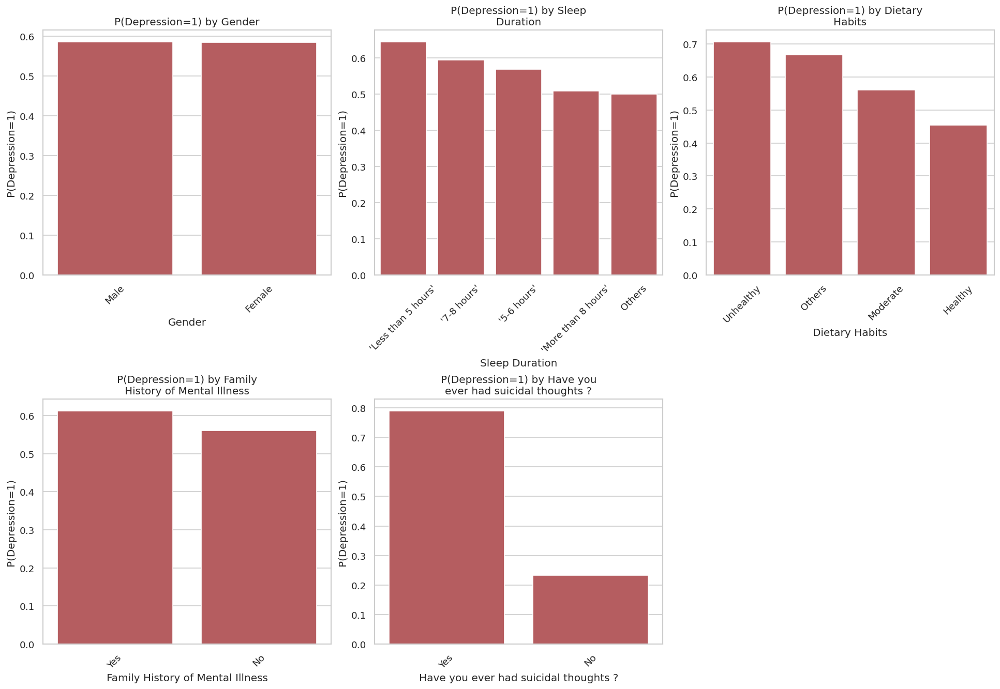
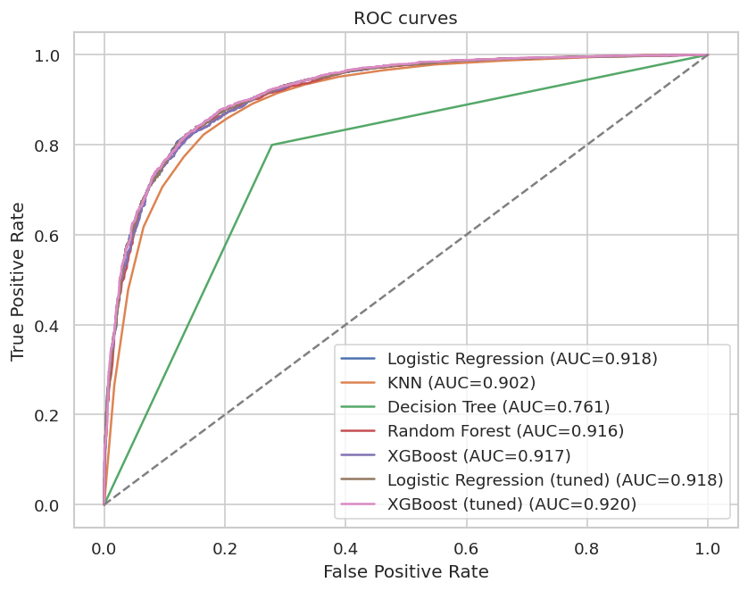
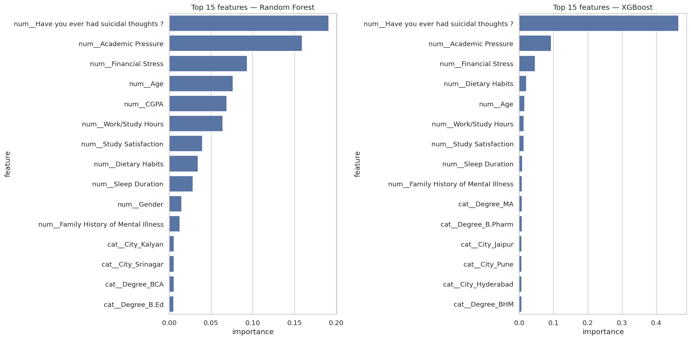

# Student Depression Analysis

End-to-end data science project on a Kaggle-style dataset of ~27 900 students,
predicting `Depression` (binary) from demographic, academic, and lifestyle features.
The project covers EDA, preprocessing, modeling, evaluation, and interpretation -
organized as three Jupyter notebooks driven by reusable `src/` modules.

## Results

| Model | ROC-AUC | F1 | Accuracy |
|-------|---------|----|----------|
| XGBoost (tuned) | 0.920 | 0.871 | 0.847 |
| Logistic Regression (tuned) | 0.918 | 0.869 | 0.845 |
| Logistic Regression | 0.918 | 0.869 | 0.845 |
| XGBoost | 0.917 | 0.865 | 0.839 |
| Random Forest | 0.916 | 0.867 | 0.841 |
| KNN | 0.902 | 0.863 | 0.834 |
| Decision Tree | 0.761 | 0.801 | 0.767 |

Best model: **`XGBoost (tuned)`** — ROC-AUC ≈ `0.920`.

Top predictors of depression (consistent across Random Forest and XGBoost):
1. History of suicidal thoughts
2. Academic pressure
3. Financial stress
4. Age
5. Work/study hours

## Highlights





## How to run

```bash
python -m venv .venv && source .venv/bin/activate
pip install -r requirements.txt
jupyter notebook  # then run notebooks in order: 01 → 02 → 03
```

## Project structure

```
data/             raw + processed splits
notebooks/        01_eda → 02_preprocessing → 03_modeling
src/              data_loader, preprocessing, visualization, models, evaluation
tests/            pytest smoke tests for preprocessing
reports/figures/  PNG exports used in this README
docs/superpowers/ design spec and implementation plan
```

## Limitations

- Dataset is India-centric and self-reported.
- Labels are not clinically validated — results predict the recorded label, not depression itself.
- Feature importance is associational, not causal.
